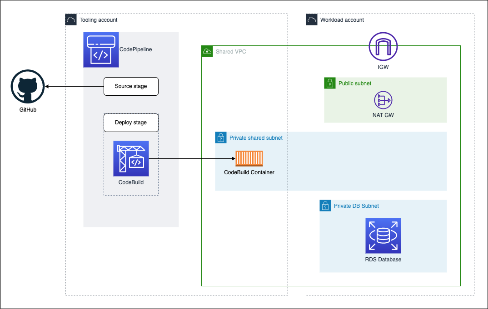

# AWS CodePipeline cross-account Liquibase

CloudFormation templates for a cross-account AWS CodePipeline deployment to update a RDS database using Liquibase.

## Table of contents

- [General info](#general-info)
- [AWS Resources](#aws-resources)
- [Setup](#setup)
  - [Pre-requisites](#pre-requisites)
  - [Create a repository with a CodeBuild buildspec and Liquibase change log file](#create-a-repository-with-a-codebuild-buildspec-and-liquibase-change-log-file)
  - [Deploy RDS database and shared subnet in the workload account](#deploy-rds-database-and-shared-subnet-in-the-workload-account)
  - [Deploy CodePipeline and CodeBuild in the tooling account](#deploy-codepipeline-and-codebuild-in-the-tooling-account)
  - [Using the Tester EC2 Launch Template to connect and check the database updates](#using-the-tester-ec2-launch-template-to-connect-and-check-the-database-updates)
## General info

This repository contains CloudFormation templates to achieve cross-account deployment of RDS database schema updates using AWS CodePipeline, AWS CodeBuild and Liquibase.

AWS CodeBuild is used to execute [Liquibase](https://github.com/liquibase/liquibase) and perform the database schema changes. The CodeBuild project is configured to use a shared subnet in the same VPC as the RDS database instance.

AWS CodePipeline is used as the deployment pipeline with a GitHub source repository and the CodeBuild project.

There are two CloudFormation templates for two separate AWS accounts:

- [workload-account/rds-shared-subnet-cfn-template.yml](./workload-account/rds-shared-subnet-cfn-template.yml) - for deploying to the **Workload account** the workload resources which include the RDS database (PostgreSQL) instance and a subnet to be shared with the tooling account.
- [tooling-account/codepipeline-cfn-template.yml](./tooling-account/codepipeline-cfn-template.yml) - for deploying to the **Tooling account** AWS CodePipeline and AWS CodeBuild project resources.




An explanation of this deployment with step by step instructions is available at: https://freddyho.hashnode.dev/aws-codepipeline-codebuild-and-shared-subnets-for-cross-account-rds-database-updates


## AWS Resources

Here is a summary of the AWS Resources that are created by the CloudFormation templates.

[rds-shared-subnet-cfn-template.yml](./workload-account/rds-shared-subnet-cfn-template.yml) in the **Workload account**:
- VPC
  - 1 x public subnet
  - 2 x private DB subnet
  - 1 x private shared subnet
  - NAT Gateway
  - Internet Gateway
- AWS Secrets Manager Secret - _for RDS database credentials_
- RDS instance (PostgreSQL)
  - RDS security group
  - RDS subnet group
- EC2 Launch template - _for tester instance_
  - Security group
  - EC2 instance profile
- Resource Access Manager - _for sharing subnet with Tooling account_
  - Resource share 

[codepipeline-cfn-template.yml](./tooling-account/codepipeline-cfn-template.yml) in the **Tooling account**:
- AWS Secrets Manager Secret - _for RDS database credentials_
- S3 Bucket - _for CodePipeline artifacts_
  - KMS key - _to encyrpt the S3 Bucket_
- AWS CodeBuild Project - _for using Liquibase to updated databse_
  - Security Group - _for using CodeBuild in a VPC shared subnet_
  - IAM Role (CodeBuild)
- AWS CodePipeline
  - IAM Role (CodePipeline)


## Setup

### Pre-requisites

The following items are pre-requisites:

- An AWS Organisation with at least two AWS accounts. One account is used as the **Workload account** and another as the **Tooling account**.

- Enable resource sharing within AWS Organizations. See: https://docs.aws.amazon.com/ram/latest/userguide/getting-started-sharing.html#getting-started-sharing-orgs

- GitHub account to be used as the source code repository for CodePipeline.

- An [AWS CodePipeline GitHub (Version 2)]() connection to your GitHub account. You will require the connection's ARN. For some help on setting this up, see: https://freddyho.hashnode.dev/use-aws-codepipeline-to-build-your-project-on-github#heading-create-a-codepipeline-github-connection

### Create a repository with a CodeBuild buildspec and Liquibase change log file

A GitHub repository is required to be the source for the CodePipeline. This repsository will contain the CodeBuild buildspec, Liquibase change log and Liquibase properties.
Samples of these files are availabile in the  directory [codebuild-liquibase-sample](./codebuild-liquibase-sample).

The sample [changelog.sql](./codebuild-liquibase-sample/changelog.sql) file creates a new table called "test_table" using Liquibase. You can modify this file to perform your desired database updates.

To create a new repository on GitHub see: https://docs.github.com/en/repositories/creating-and-managing-repositories/creating-a-new-repository.

The below commands are an example to make a copy of the sample CodeBuild and Liquibase files for a GitHub repository called "liquibase-deploy-demo".

```bash
 # Create directory for new GitHub repo
 mkdir liquibase-deploy-demo

 # Copy sample CodeBuild and Liquibase files to new repo
 cp aws-codepipeline-cross-account-liquibase/codebuild-liquibase-sample/* liquibase-deploy-demo

# Initialise your local git repository and commit the new files
 cd liquibase-deploy-demo
 git init
 git add .
 git commit -m "Add sample CodeBuild and Liquibase files"
 git branch -M main

# Push to GitHub
# Replace YOUR_GITHUB_ACCOUNT with your own GitHub account mame
git remote add origin https://github.com/YOUR_GITHUB_ACCOUNT/liquibase-deploy-demo.git
git push -u origin main
```

### Deploy RDS database and shared subnet in the workload account

Deploy the CloudFormation stack using the template file [workload-account/rds-shared-subnet-cfn-template.yml](./workload-account/rds-shared-subnet-cfn-template.yml) to your **Workload account**.

This will deploy the RDS database instance and share a VPC subnet with a provided Tooling account ID (`ToolingAccountId`).

Below is an example of the minimum parameters to deploy this CloudFormation Stack:

**demo-workload-parameters.json**

```JSON
{
    "Parameters": {
        "EnvironmentName": "demo-workload",
        "ToolingAccountId": "111111111111",
        "RDSDatabaseUsername": "postgres",
        "RDSDatabasePassword": "DemoPassword123",
    }
}
```

The following example AWS CLI command can be used to deploy the CloudFormation stack to the **Workload account**:

```bash
	aws cloudformation deploy \
	--template-file workload-account/rds-shared-subnet-cfn-template.yml \
	--stack-name demo-workload \
	--capabilities CAPABILITY_NAMED_IAM \
	--parameter-overrides file://demo-workload-parameters.json
```

Take note of the stack outputs as their values will be used when deploying the next CloudFormation stack to the Tooling account.

### Deploy CodePipeline and CodeBuild in the tooling account

Deploy the CloudFormation stack using the template file [tooling-account/codepipeline-cfn-template.yml](./tooling-account/codepipeline-cfn-template.yml) to your **Tooling account**.
This should be done after [Deploy RDS database and shared subnet in the workload account](#deploy-rds-database-and-shared-subnet-in-the-workload-account).

This will deploy the CodePipeline and CodeBuild configured to use the shared subnet from the Workload account.

Below is an example of the minimum parameters to deploy this CloudFormation Stack. Use your CodePipeline GitHub connection ARN for `ConnectionArn`.
Parameter values for `RDSEndpoint`, `SubnetIds` and `VpcId` can be taken from the outputs of the previous CloudFormation stack deployed to the Workload account.

**demo-tooling-parameters.json**

```json
{
    "Parameters": {
        "EnvironmentName": "demo-tooling",
        "ConnectionArn": "arn:aws:codestar-connections:ap-southeast-2:111111111111:connection/aaaaaaaa-bbbb-cccc-dddd-eeeeeeffffff",
        "FullRepositoryId": "<YOUR_GITHUB_ACCOUNT>/liquibase-deploy-demo",
        "RDSDatabaseUsername": "postgres",
        "RDSDatabasePassword": "DemoPassword123",
        "RDSEndpoint": "<RDSEndpointAddress>",
        "SubnetIds": "<SharedSubnetId>",
        "VpcId": "<VPCId>"
    }
}
```

The following example AWS CLI command can be used to deploy the CloudFormation stack to the **Workload account**:

```bash
	aws cloudformation deploy \
	--template-file tooling-account/codepipeline-cfn-template.yml \
	--stack-name demo-tooling \
	--capabilities CAPABILITY_NAMED_IAM \
	--parameter-overrides file://demo-tooling-parameters.json
```

### Using the Tester EC2 Launch Template to connect and check the database updates

The CloudFormation stack deployed to the **Worload account** creates an EC2 Launch template that can be used to launch a "tester" EC2 instance with connectivity to the RDS instance endpoint.

The Launch template ID is provided in the stack output `EC2TesterLaunchTemplateId`.

The EC2 instance Instance profile provides permissions to use AWS Systems Manager Session Manager to connect to it (see https://docs.aws.amazon.com/systems-manager/latest/userguide/session-manager-working-with-sessions-start.html#start-ec2-console).

To launch an instance with the Launch template, see https://docs.aws.amazon.com/AWSEC2/latest/UserGuide/launch-instances-from-launch-template.html#launch-instance-from-launch-template.
Once connected to the tester EC2 instance, you can install a PostgreSQL client and connect to the RDS database instance.

If using Amazon Linux 2 AMI, you can use the following command to install a PostgreSQL client:

```bash
sudo amazon-linux-extras install postgresql14
```

Using the PostgreSQL client, connect to the database:

```bash
psql \
   --host=<DB instance endpoint> \
   --username=<master username> \
   --password
```

Check that the "test_table" has been created:

```sql
postgres=> \dt
                  List of relations
  Schema |         Name          | Type  |  Owner
 --------+-----------------------+-------+----------
  public | databasechangelog     | table | postgres
  public | databasechangeloglock | table | postgres
  public | test_table            | table | postgres

```

Check the change logs in the "databasechangelog" table:

```sql
postgres=> SELECT id, author, filename, dateexecuted, exectype FROM databasechangelog;

  id |  author   |   filename    |        dateexecuted        | exectype
 ----+-----------+---------------+----------------------------+----------
  1  | liquibase | changelog.sql | 2023-03-19 23:04:47.585474 | EXECUTED
```
